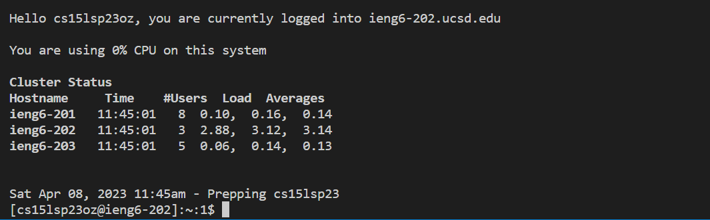

# Lab 1 <br/>
This is a tutorial for incoming cse15L students as well as future me on how to login to the course-specific account on ieng6. <br/>
<br/>
The tutorial is conducted on windows and screenshots are taken accordingly. For commands on macOS, go to <https://ucsd-cse15l-s23.github.io/week/week1/> for more information. <br/>
<br/>
__Step 1: Install VSCode__<br/>
Go to <https://code.visualstudio.com/> and download VSCode according to your operating system.<br/>
After installation, you should get something like this: <br/>
 <br/>
<br/>
__Step 2: Install git and make git bash your terminal for login server__<br/>
Go to <https://gitforwindows.org/> and download git for windows.<br/>
Go to <https://stackoverflow.com/questions/42606837/how-do-i-use-bash-on-windows-from-the-visual-studio-code-integrated-terminal/50527994#50527994> and change the terminal in vscode to bash terminal.<br/>
<br/>
__Step 3: Login to server__<br/>
Find your course specific account at <https://sdacs.ucsd.edu/~icc/index.php> <br/>
You might need to reset your password if you are logging in for the first time. <br/>
A tutorial for resetting password could be found here <https://drive.google.com/file/d/17IDZn8Qq7Q0RkYMxdiIR0o6HJ3B5YqSW/view?usp=share_link> <br/>
Once you're set, go to bash terminal in vscode and type in ```ssh``` followed by your course specific username + "@ieng6.ucsd.edu" <br/>
If it shows "connection denied by host" or something like that, try adding "-202" which appoints to a specific server following "@ieng6" <br/>
For the first time login, it may ask to whether to continue connecting or not; type ```yes``` in command <br/>
You will get something like this: <br/>
 <br/>
Note that neither the cursor nor input will show in this case. If your password is wrong, it will ask for it again like the example above.<br/>
If login successfully, it will show something like this: <br/>
 <br/>
This process could be troublesome so make sure you ask TAs for help if anything is not working :^) <br/>
<br/>
__Step 4: Run some command lines in bash terminal__<br/>
Try some command lines: <br/>
<br/>
For the commands in the above image, <br/>
I use ```pwd``` to print out the working directory to see where am I at on the server<br/>
Then ```cd``` to make sure I'm at the home directory as it makes you go back to previous directory when not following by any other path<br/>
The next command is ```cp /home/linux/ieng6/cs15lsp23oz/public/hello.txt ~/``` which copies the "hello.txt" file from "public" directory to home directory<br/>
The ```cat``` command prints out the content of "hello.txt" file in the "public" directory <br/>
<br/>
The command ```pwd``` prints out current working directory which, in this case, the directory on the server. <br/>
The command ```ls .../cs15lsp23op``` tries to access to another account's directory which is denied. <br/>
The command ```exit``` is used to logout the server. <br/>
<br/>
This is the end of the tutorial.
