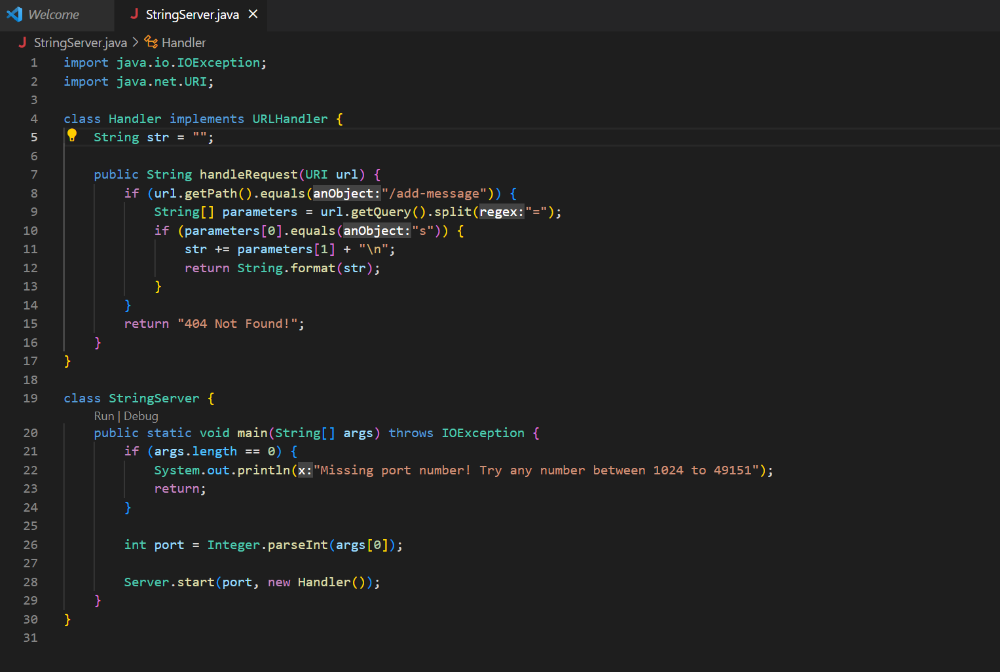
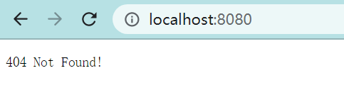
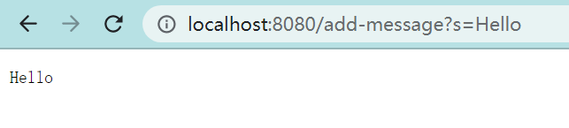

# Lab Report 2
## Part 1
<br/>
This part is to create a web server that "keeps track of a single string that gets added to by incoming requests" (week3 lab report 2). <br/>
<br/>
__Code for StringServer:__ <br/>
<br/>
<br/>
__Screen Shot for__  ```/add-message?s=Hello``` <br/>
<br/>
 <br/>
* In this example, methods ```public String handleRequest(URI url)``` and ```start()``` of Server Class as well as the main method are called.
* In the handleRequest method, an argument ```URI url``` is passed in for the method to modify the request and query. The variable ```String str``` in the Handler class stored the string value from the query and keeps track of it as more queries are passed in.
* ```url.getPath()``` gets the request from the url and determines the following action.
* ```url.getQuery()``` gets the query from the url and determines the value to stroe in the string field.
* There are also minor methods like ```parseInt()``` and ```equals()``` but they are mainly for modifying Strings, not handling the requests.
* In this request, the value of field "str" is changed as the string value from the query is added to it and gets displayed.
__Screen Shot for__  ```/add-message?s=Hello``` __&__ ```/add-message?s=How are you```<br/>
 <br/>
<br/>
