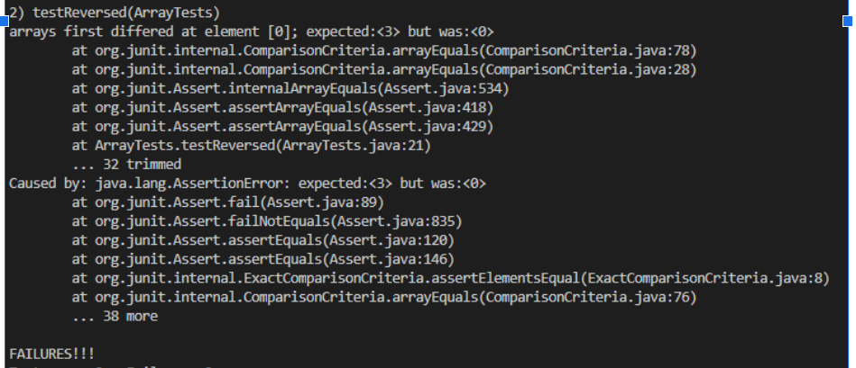

# Lab Report 2
## Part 1
This part is to create a web server that "keeps track of a single string that gets added to by incoming requests" (week3 lab report 2). <br/>
<br/>
__Code for StringServer:__ <br/>
<br/>
<br/>
__Screen Shot for__  ```/add-message?s=Hello``` <br/>
<br/>

* In this example, methods ```public String handleRequest(URI url)``` and ```start()``` of Server Class as well as the main method are called.
* In the handleRequest method, an argument ```URI url``` is passed in for the method to modify the request and query. The variable ```String str``` in the Handler class stored the string value from the query and keeps track of it as more queries are passed in.
* ```url.getPath()``` gets the request from the url and determines the following action.
* ```url.getQuery()``` gets the query from the url and determines the value to stroe in the string field.
* There are also minor methods like ```parseInt()``` and ```equals()``` but they are mainly for modifying Strings, not handling the requests.
* In this request, the value of field "str" is changed as the string value "Hello" from the query is added to it and gets displayed.
<br/>
<br/>
__Screen Shot for__  ```/add-message?s=Hello``` __&__ ```/add-message?s=How are you```<br/>

<br/>
* In this example, methods ```public String handleRequest(URI url)``` and ```start()``` of Server Class as well as the main method are called.
* In the handleRequest method, an argument ```URI url``` is passed in for the method to modify the request and query. The variable ```String str``` in the Handler class stored the string value from the query and keeps track of it as more queries are passed in.
* ```url.getPath()``` gets the request from the url and determines the following action.
* ```url.getQuery()``` gets the query from the url and determines the value to stroe in the string field.
* There are also minor methods like ```parseInt()``` and ```equals()``` but they are mainly for modifying Strings, not handling the requests.
* In this request, the value of ```str``` is changed twice as not only "Hello" but also later "How are you" is added one by one to ```str```.
<br/>
<br/>
__Screen Shot for__ no request given: <br/>

<br/>
* When either no request nor no correct query is given, the method ```handleRequest``` returns 404 and displayed it.
<br/>
<br/>
## Part 2
This part demonstrates one of the bugs from lab 3 and its fix. <br/>
The origninal code with bug is: <br/>
```static int[] reversed(int[] arr) {
    int[] newArray = new int[arr.length];
    for(int i = 0; i < arr.length; i += 1) {
      arr[i] = newArray[arr.length - i - 1];
    }
    return arr;
  }``` <br/>
  which attempts to return an array of the elements in input array in reverse order.<br/>
A failure-inducing input is: <br/>
``` @Test
  public void testReversedIncorrect() {
    int[] input1 = {1,2,3,4};
    assertArrayEquals(new int[]{4,3,2,1}, ArrayExamples.reversed(input1));
  }```<br/>
An input that doesn't cause a failure: <br/>
``` @Test
  public void testReversedCorrect() {
    int[] input1 = { };
    assertArrayEquals(new int[]{ }, ArrayExamples.reversed(input1));
  }```<br/>
The symptom of the program: <br/>
 <br/>
The screenshot shows only the incorrect test and we can see that the returned array has different element in the first index as expected which is the same as the original array, "1". <br/>
The program attempts to reverse the array by creating an array of equal length as the input array and assigns the element from input array to new array in reverse order.<br/>
The lines that need to be fixed are: ```arr[i] = newArray[arr.length - i - 1];``` and ```return arr;```<br/>
The fixed lines should be ```newArray[i] = arr[arr.length - i - 1];``` which assigns the last ith element to the ith element of new array. <br/>
and ```return newArray;``` which return the correct reversed array. <br/>
## Part 3
The first thing I've learned in these 2 labs is the step to handle a http request. The first few slashes which type of requests the program should handle and then it goes to indicate the input or query and make corresponding reponse. The server is also consisted of port and when one port is in used, it will cause trouble for others(or even yourself) to start your server on that port. Another thing I've learned is github allows us push our changes with comments so we can refer to these changes in different checkpoint to compare the program. When I go to the fork I pushed, I can see the same file with "checkpoint2" and "checkpoint3" to compare them and see the changes I made.
