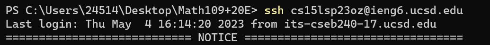
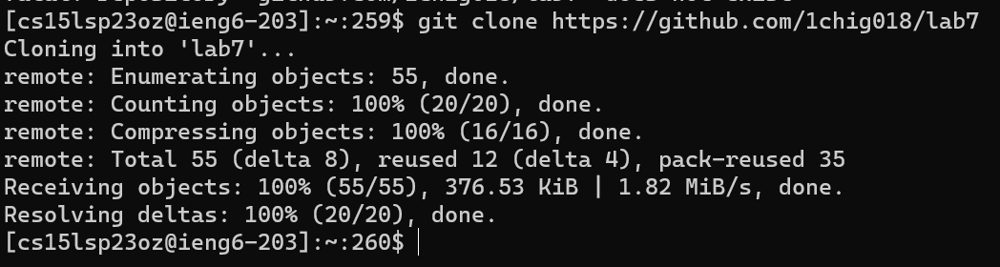
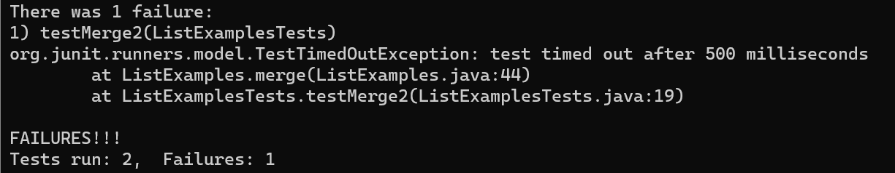
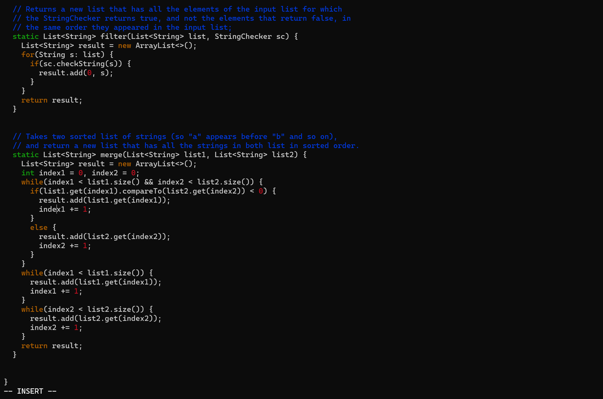
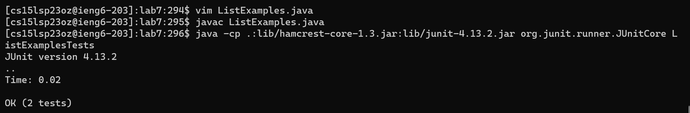
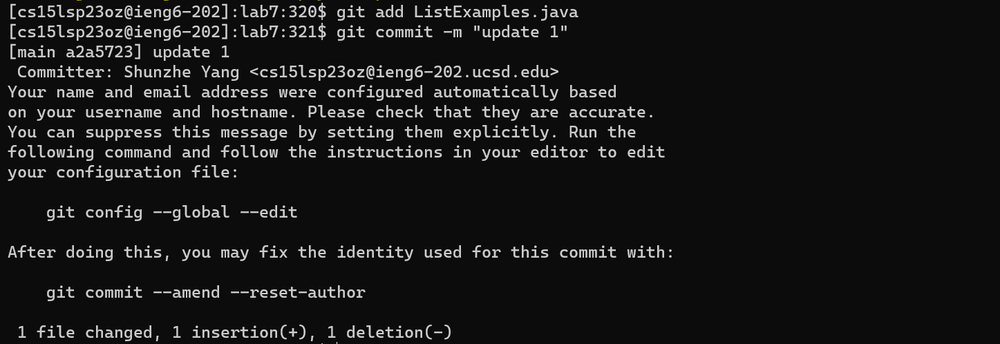
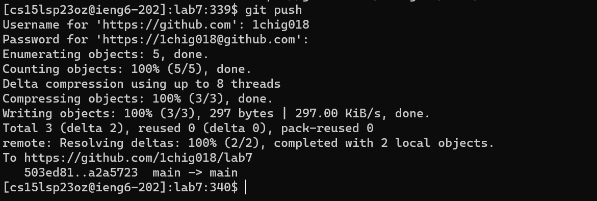

# Lab Report 4
In this lab report, we will clone github repo, run tests and fix bugs in code file, and commit changes on server according to the steps 4-9 in <https://ucsd-cse15l-s23.github.io/week/week7/#week7-lab-report>. <br/>
Step 1: loggin to ieng6 <br/>
<br/>
Command: ```ssh cs15lsp23oz@ieng6.ucsd.edu <enter>``` <br/>
Since we have "saved" our password for ssh loggin on our computer following lab instructions, there's no request for password here. <br/>
Step 2: Clone fork of repo from github <br/>
<br/>
Command: ```git clone https://github.com/1chig018/lab7 <enter>``` <br/>
This command clone the repo from github. <br/>
Step 3: Run the tests <br/>
<br/>
Command: ```cd lab7 <enter> ls <enter> javac -cp .:lib/hamcrest-core-1.3.jar:lib/junit-4.13.2.jar *.java <enter> java -cp .:lib/hamcrest-core-1.3.jar:lib/junit-4.13.2.jar org.junit.runner.JUnitCore ListExampleTests```<br/>
The commands goes to lab7 repo, compile and run the tester file. <br/>
Step 4: Edit the code file <br/>
<br/>
Command: ```vim ListE <tab> .java <enter> <i> <up><up><up><up><up><up> <right><right><right><right><right> <bckspc> <2> <esc> :wq <enter>```<br/>
The command opens the vim editor, goes to insert mode, goes to the line that needs to be fixed, change 1 to 2, go to normal mode and save the changes. <br/>
Step 5: Run the tests again <br/>
<br/>
Command: ```java -cp .:lib/hamcrest-core-1.3.jar:lib/junit-4.13.2.jar org.junit.runner.JUnitCore ListExamplesTests```<br/>
The command rerun the tester to show the change works. <br/>
Step 6: Push the changes <br/>
<br/>
<br/>
Command: ```git add List<tab>.java <enter> git commit -m "update" <enter> git push <enter> 1chig018 <enter> "Password" <enter>```<br/>
The command push the changed file back to github.
