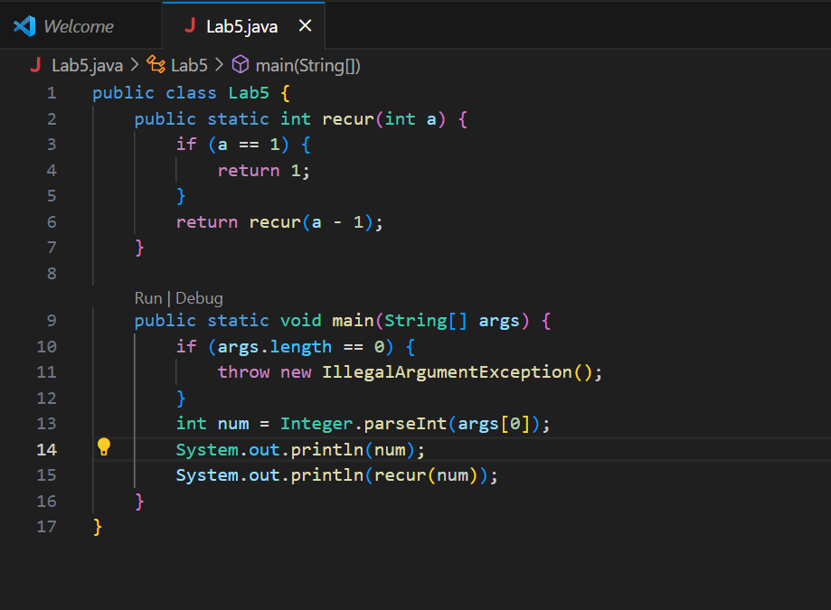
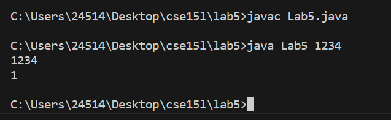
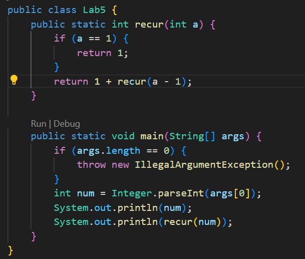
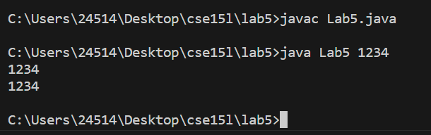

# Part 1 - Debugging <br/>
__What environment are you using (computer, operating system, web browser, terminal/editor, and so on)?__ <br/>
Laptop, Win 11 x64, vscode, command prompt <br/>
__Detail the symptom you're seeing. Be specific; include both what you're seeing and what you expected to see instead. Screenshots are great, copy-pasted terminal output is also great. Avoid saying “it doesn't work”.__<br/>

 <br/>
The program should return the number as entered but through a recursion that counts up to the number. Since the input is 1234, we expect to see 1234 as output but 1 is shown instead. <br/>
__Detail the failure-inducing input and context. That might mean any or all of the command you're running, a test case, command-line arguments, working directory, even the last few commands you ran. Do your best to provide as much context as you can.__<br/>
Command Runned: ```javac Lab5.java java Lab5 1234``` <br/>
Working Directory: ~Desktop/cse15l/lab5 <br/>
No test cases or testers <br/>
__TA Response__ <br/>
It appears the bug is caused by you not considering the return statement of the recur() method. Only the last case of 1 is returned. <br/>
__Student Attempt__ <br/>

 <br/>
The TA is right; i was missing the part where the count for __this__ time is considered. By adding 1 before the recur method, the test is now successful. <br/>
__Setup__<br/>
Files: Lab5.java <br/>
Directory: ~Desktop/cse15l/lab5 <br/>
Code before fix: <br/>
```
public class Lab5 {
    public static int recur(int a) {
        if (a == 1) {
            return 1;
        }
        return recur(a--);
    }

    public static void main(String[] args) {
        if (args.length == 0) {
            throw new IllegalArgumentException();
        }
        int num = Integer.parseInt(args[0]);
        System.out.println(num);
        System.out.println(recur(num));
    }
}
``` 
<br/>
Code after fix: <br/>
```
public class Lab5 {
    public static int recur(int a) {
        if (a == 1) {
            return 1;
        }
        return 1 + recur(a--);
    }

    public static void main(String[] args) {
        if (args.length == 0) {
            throw new IllegalArgumentException();
        }
        int num = Integer.parseInt(args[0]);
        System.out.println(num);
        System.out.println(recur(num));
    }
}
```
<br/>
Command Lines Runned: ```javac Lab5.java java Lab5 1234``` <br/>
Fix to the Bug: add 1 before recur to add the current count. <br/>
# Part 2 Reflection
